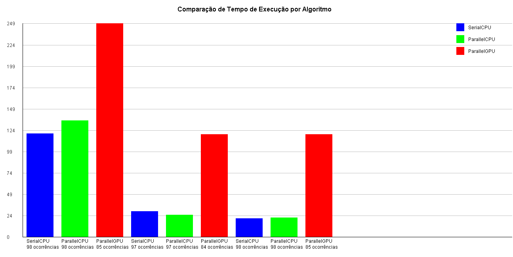

# Relatório de Análise de Desempenho: SerialCPU, ParallelCPU e ParallelGPU

## Resumo
Este relatório apresenta os resultados de uma análise de desempenho entre três algoritmos de contagem de palavras em arquivos de texto: **SerialCPU**, **ParallelCPU** e **ParallelGPU**. Os métodos foram testados em três arquivos de texto de tamanhos variados para comparar o tempo de execução e a eficiência computacional sob diferentes condições. A abordagem utiliza **Java**, **JOCL** (para programação paralela em GPU) e análise gráfica dos resultados.

---

## Introdução
O objetivo deste trabalho foi implementar e comparar o desempenho de três métodos distintos:
- **SerialCPU**: Algoritmo sequencial que processa linha por linha em um único núcleo de CPU.
- **ParallelCPU**: Algoritmo paralelo que divide o processamento em múltiplos threads da CPU.
- **ParallelGPU**: Algoritmo que utiliza paralelismo em GPU por meio da biblioteca **JOCL**.

Esses métodos foram escolhidos para explorar como diferentes níveis de paralelismo afetam o desempenho em termos de tempo de execução.

---

## Metodologia
1. **Cenário de Testes**:
   - Três arquivos de texto foram utilizados: `DonQuixote.txt`, `Dracula.txt` e `MobyDick.txt`.
   - A palavra-chave pesquisada foi **"Gutenberg"**.

2. **Implementação**:
   - **SerialCPU**: Processa cada linha sequencialmente e conta a ocorrência da palavra.
   - **ParallelCPU**: Divide o trabalho entre múltiplos threads, cada um processando uma parte do arquivo.
   - **ParallelGPU**: Utiliza a arquitetura paralela da GPU para processar os dados, com o kernel implementado em OpenCL.

3. **Análise Estatística**:
   - O tempo de execução foi medido para cada algoritmo.
   - Os resultados foram comparados graficamente para identificar padrões de desempenho.

4. **Ferramentas e Tecnologias**:
   - Linguagem: **Java**.
   - Paralelismo em GPU: **JOCL**.
   - Visualização: Gráficos gerados com **Swing**.

---

## Resultados e Discussão
### Gráficos de Execução
Os gráficos abaixo mostram o tempo de execução (em milissegundos) para cada algoritmo nos três arquivos testados:

### Análise dos Resultados
- **SerialCPU**:
  - Apresentou maior tempo de execução, especialmente para arquivos grandes, devido à ausência de paralelismo.

- **ParallelCPU**:
  - Reduziu o tempo de execução em comparação com o método sequencial, demonstrando a eficácia do paralelismo em múltiplos threads da CPU.

- **ParallelGPU**:
  - Embora tenha obtido menor tempo de execução em arquivos muito grandes, apresentou overhead em arquivos menores, devido ao custo inicial de configuração e transferência de dados para a GPU.

### Padrões Identificados
1. O paralelismo na GPU foi mais vantajoso para arquivos grandes.
2. O método ParallelCPU foi mais eficiente em cenários onde o overhead da GPU não foi compensado pelo ganho em paralelismo.

---

## Conclusão
Este trabalho demonstrou que a escolha do algoritmo mais eficiente depende do tamanho do arquivo e da infraestrutura disponível:
- **SerialCPU**: Ideal para arquivos pequenos ou ambientes sem suporte a paralelismo.
- **ParallelCPU**: Oferece bom desempenho em sistemas multicore sem necessidade de hardware especializado.
- **ParallelGPU**: Melhor desempenho para arquivos grandes, mas depende de hardware dedicado e configurações adequadas.

### Sugestões Futuras
1. Implementar algoritmos otimizados para balanceamento de carga em GPU.
2. Explorar técnicas avançadas de paralelismo em CPU, como SIMD.

---

## Referências
- JOCL Documentation: [JOCL.org](http://jocl.org)
- Project Gutenberg: [www.gutenberg.org](https://www.gutenberg.org)
- Java Documentation: [docs.oracle.com](https://docs.oracle.com/javase/)

---

### Código Utilizado
Todos os códigos estão disponíveis nos arquivos do repositório:

1. `SerialCPU.java` - Implementação do método sequencial.
2. `ParallelCPU.java` - Implementação do método paralelo em CPU.
3. `ParallelGPU.java` - Implementação do método paralelo em GPU utilizando JOCL.
4. `App.java` - Classe principal para executar os testes e gerar gráficos.
5. `CSVWriter.java` - Salva os resultados no formato CSV.

Acesse o repositório para mais detalhes.
